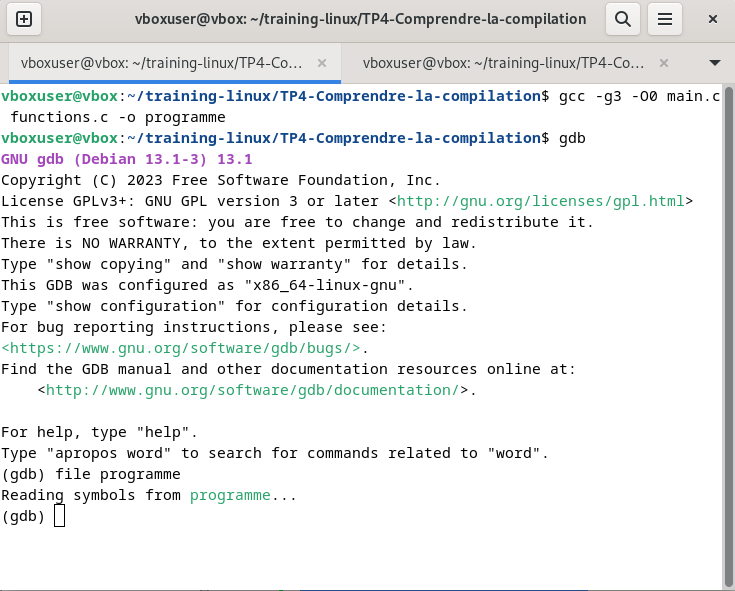
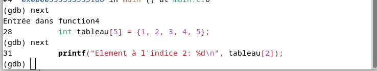
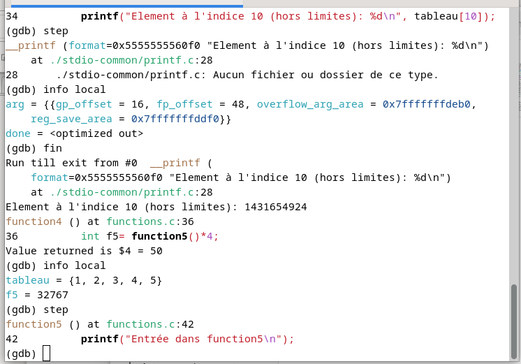
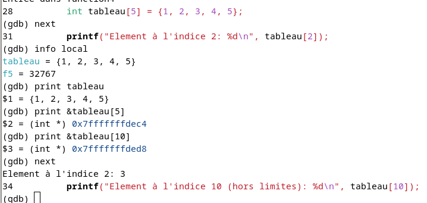
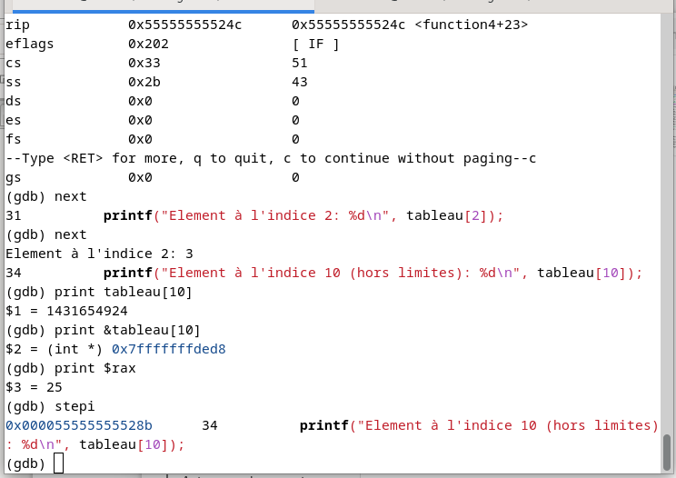

# 🧮 Projet GDB

## 1. Qu'est-ce que GDB?

GDB (GNU Debugger) est un débogueur puissant qui permet d'analyser l'exécution d'un programme. Il vous permet de:

* Exécuter un programme pas à pas

* Examiner ce qui se passe quand le programme plante

* Vérifier les valeurs des variables à un moment donné

* Modifier le comportement du programme pendant l'exécution

## 2. Compilation avec l'option -g de GCC
L'option -g de GCC est cruciale pour utiliser GDB efficacement.

### À quoi sert l'option -g?

Quand vous compilez avec gcc -g, le compilateur inclut des informations de débogage dans l'exécutable:

* Table des symboles (noms des variables et fonctions)

* Correspondance entre le code machine et le code source

* Informations sur les types de données

* Numéros de ligne du code source


## 3.  Compilation et Demarrage de gdb

### Installation de gdb

```bash
sudo apt update
sudo apt install gdb
```

### Compilation avec l'option -g

```
# Avec informations de débogage (recommandé)
gcc -g programme.c -o programme

# Avec plus d'informations de débogage
gcc -g3 programme.c -o programme

# Désactiver l'optimisation (recommandé pour le debug)
gcc -g -O0 programme.c -o programme
# Lancer GDB avec votre programme
gdb ./programme

# Ou lancer GDB puis charger le programme
gdb
(gdb) file ./programme
```

## 4. Etape de débogage

Ici nous illustrons par des images les différente étape de débogage du programme  avec des explications associées.

### a) Etape1 : Démarrer GDB
#### Image


### b) Etape2 : Définir un point d'arrêt au niveau de la function4
#### Image


#### Sur cet image ci-dessus, nous avons 5 frames de la pile d'appels (Call Stack) en cour d'execution affiché .

- Frame #0:la première frame tout au dessus d'indice #0 est la frame actuellement exécutée.
- Frame #1 : function3() - A appelé function4
- Frame #2 : function2() - A appelé function3
- Frame #3 : function1() - A appelé function2
- Frame #4 : main() - Point de départ - A appelé function1

#### chaque frame peut contenir :
= l'Adresse de retour ,
= Des Variables locales ,
= Des Paramètres (arguments passés à la fonction),
= Des Registres sauvegardés** (état du processeur)

#### Explication du fonctionnement de la pile en image ci-dessus:

 Danc cette pile:
- On a commencé par main donc l'exécution à entrainer la création de la pile et son insertion comme première frame de la pile,
- Ensuite main a appelé la function1 qui a été ajouté a la pile ,
- Et la function1 lui meme a appelé la function2 qui a été ajouté à la pile ,
- La function2 a appelé la function 3 qui a été ajouté à la pile
- Ceci jusqu'à la dernière function à retourner une valeur qui sera suprimer de la file et sa valeur transmise à la function appelante.
- Chaque appel de fonction ajoute un frame à la pile, et chaque retour enlève un frame. C'est le mécanisme LIFO (Last In, First Out) de la pile d'appels.**

### c) Etape 3 : Navigation dans la fonction d'arret qui contient le bug
#### Image1


* Ici après avoir break sur la function4 et run nous somme maintenant a l'interieur de la function4.
* nous Exécutons de ligne d'instruction à ligne d'instruction grace à la commande `next` ceci sans entrer dans les fonctions appelées.
#### Image2


* Ici avec les commande `step(s)` pour exécuter et entrer dans les function appelé
* Et `finish(fin)` pour Terminer l'exécution de la fonction courante et retourne au niveau appelant.

### d) Etape4 : Track et debug sur la function4

#### Image1

#### Image2


* Ici nous Inspectons les variables  de la pile,
* accédons à leur valeur avec possibilite de modifier pour verification

## 5. Commande essentiel pour le traquage pas à pas
```bash
next (n) : Exécute la ligne suivante (ne rentre pas dans les fonctions)
step (s) : Exécute la ligne suivante (rentre dans les fonctions)
stepi (si) : Exécute l'instruction machine suivante (le plus granulaire)
```

## 6. Analyse après l'erreur Si le programme plante :
```bash
(gdb) backtrace full  # Pile d'appels avec variables locales
(gdb) info registers  # État des registres au moment du crash
(gdb) x/10i $pc-20    # Instructions autour du pointeur d'instruction
(gdb) info frame      # Informations sur le frame actuel
```

## 7. Points d'arrêt conditionnels et Utilisation de watch pour surveiller la mémoire
```bash
(gdb) watch *(int*)0x7fffffffdc28  # Surveiller l'adresse de tableau[10]
(gdb) continue  # S'arrêtera quand cette mémoire sera lue/écrite
(gdb) break function4 if tableau[2] == 3
(gdb) break 29 if i == 10  # S'arrêter à la ligne 29 seulement quand i vaut 10
```

## 8. Commande avancé

- Points d'arrêt conditionnels
```bash
 (gdb) break 10 if i == 2    # S'arrêter seulement quand i == 2
(gdb) condition 1 temp > 10 # Ajouter condition au breakpoint #1
```

- Watchpoints (surveillance de variables)
```bash
 (gdb) watch temp            # S'arrêter quand 'temp' change
(gdb) rwatch temp           # S'arrêter quand 'temp' est lu
(gdb) awatch temp           # S'arrêter quand 'temp' est lu ou écrit
```

- Examiner la mémoire
```bash
 (gdb) x/10i $pc            # 10 instructions à partir du PC
(gdb) x/4wx &variable      # 4 mots en hexa à l'adresse de variable
(gdb) disassemble          # Code assembleur de la fonction courante
```

- Modifier des valeurs
```bash
(gdb) set variable = nouvelle_valeur
(gdb) set temp = 100       # Changer la valeur de temp
```

