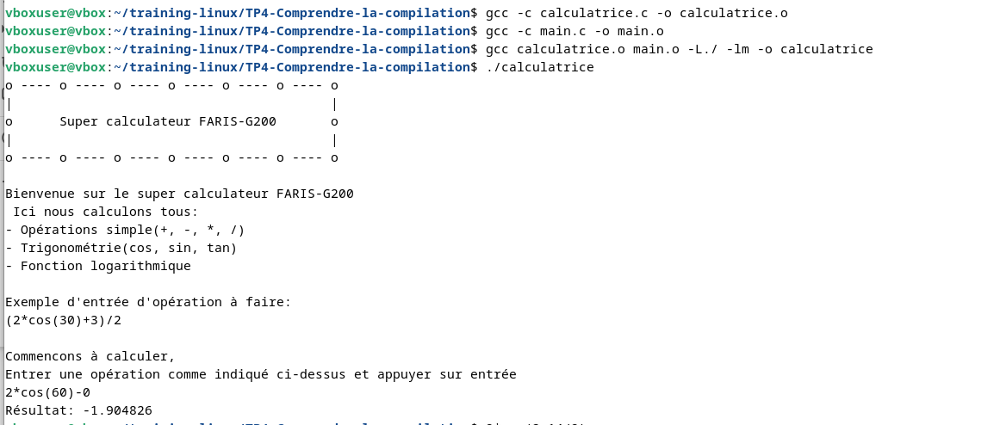
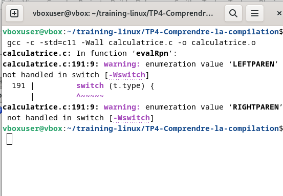
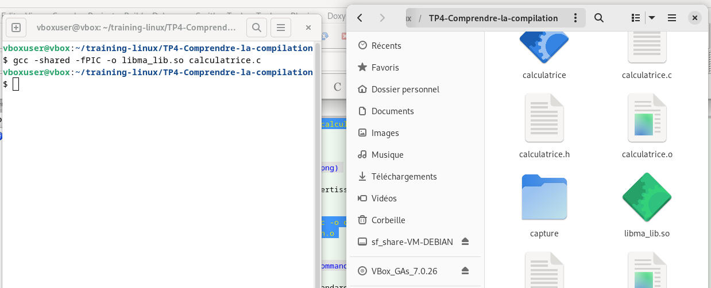
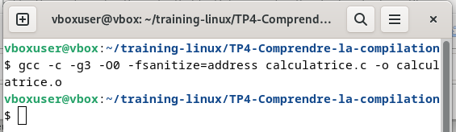
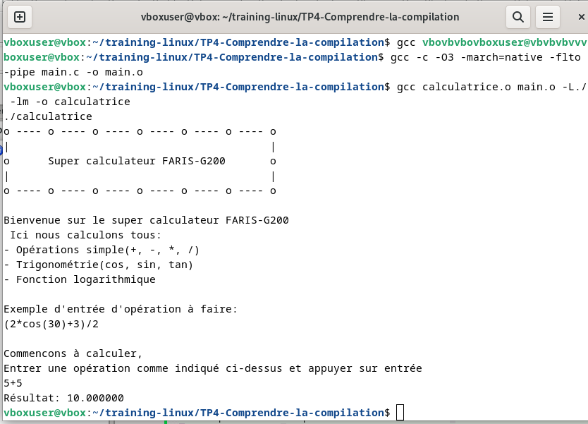
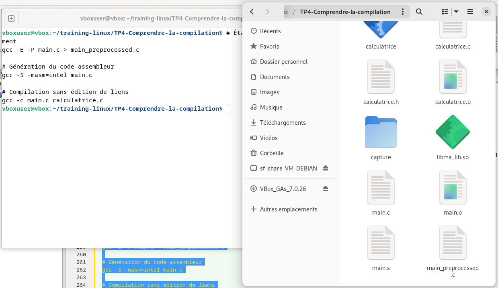
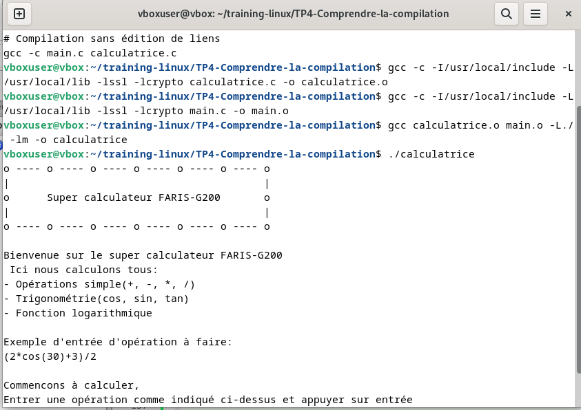
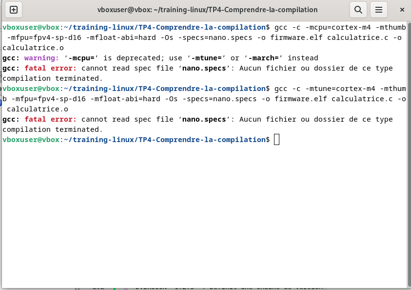

# 🧮 Projet Calculatrice

Dans ce projet nous avons mis en place un programme écrit en C qui permet de faire des opérations suivantes :
- **Arithmétique simple** (+, -, *, /)
- **Trigonométrie**
- **Fonctions logarithmiques**

---

## 📁 Etape 0 : Structure du projet

Le projet comporte les fichiers suivants issus des programmes écrits et de la compilation :
`calculatrice.h`, `calculatrice.c`, `main.c`, `calculatrice.o`, `main.o`

*   **`calculatrice.h`** (extension `.h`) : utilisé pour la déclaration des fonctions et structures
*   **`calculatrice.c`** (extension `.c`) : utilisé pour l'implémentation des fonctions issues de `calculatrice.h`
*   **`main.c`** : programme principal, point d'entrée pour l'utilisateur, lieu d'appel des différentes fonctions déclarées dans `calculatrice.c`. C'est le fichier qui réalise les instructions d'exécution.

Suivez les étapes ci-dessous et exécutez les commandes suivantes pour compiler le programme enfin d'effectuer les opérations.

---

## 🚀 Etape 1 : Cloner le repository

```bash
git clone git@github.com:farisbrandone/TP4-Comprendre-la-compilation.git
cd TP4-Comprendre-la-compilation
```

## Étape 2 : Explorer la structure du projet

```bash
ls -la
```
## Phase 1 : Compilation

Cette phase permet d'obtenir le fichier object (.o) et comporte :
- Le traitement par le préprocesseur
- La compilation proprement dite
- L'assemblage

### Commandes à exécuter (dans le dossier du projet) :

```bash
gcc -c calculatrice.c -o calculatrice.o
gcc -c main.c -o main.o
```
## Phase 2 : Édition des liens

Dans cette phase :
- Les fichiers object obtenus de la compilation sont liés entre eux
- Sont ajoutés les fichiers objects correspondants aux librairies précompilées ayant pour extension (.a)

### Commande à exécuter :

```bash
gcc calculatrice.o main.o -L./ -lm -o calculatrice
```
-  **`bash -L./`** permet de lier calculatrice.o à main.o et **`-lm`** pour lier main.o avec les librairies mathématique.

### Si vous souhaiter n'activer que l'étape :

- de traitement par le preprocesseur pendant la compilation alors taper la commande suivante:

```bash
    gcc -E calculatrice.c -o calculatrice.i
```
- de preprocesseur et de compilation et obtenir un fichier assembleur alors taper la commande suivante:
```bash
    gcc -S calculatrice.c -o calculatrice.s
```
- produire des infos symbolique au deboguage pour une compilation complète en une seule fois
```bash
    gcc -g calculatrice.c -o calculatrice
```

## Etape4: Exécution

 une fois l'etape de compilation terminer nous obtenons un fichier dit   **`EXÉCUTABLE`** nommé `calculatrice`

 * Commande pour lancer l'exécutable
```bash
  ./calculatrice
```

### Ensemble des options de compilation avec leurs roles clés

##  Options générales

- -o <fichier> : Spécifie le nom du fichier de sortie

- -c : Compile sans lier (génère des fichiers .o)

- -E : Arrête après l'étape de préprocessing

- -S : Arrête après l'étape de compilation (génère du code assembleur)

- -v : Mode verbeux (affiche les commandes exécutées)

## Options d'optimisation

- -O0 : Pas d'optimisation (défaut)

- -O1 ou -O : Optimisation de base

- -O2 : Optimisation standard (recommandé)

- -O3 : Optimisation agressive

- -Os : Optimisation pour la taille

- -Og : Optimisation pour le débogage

## Options d'avertissement et d'erreurs

- -Wall : Active tous les warnings courants

- -Wextra : Active des warnings supplémentaires

- -Werror : Traite les warnings comme des erreurs

- -Wpedantic ou -pedantic : Conformité stricte au standard

- -Wno-<warning> : Désactive un warning spécifique

- -### : Affiche les commandes sans les exécuter

## Options de débogage

- -g : Inclut les informations de débogage

- -ggdb : Informations de débogage spécifiques à GDB

- -g3 : Informations de débogage étendues

## Options de standard C

- -std=c89 ou -std=c90 : Standard C89/C90

- -std=c99 : Standard C99

- -std=c11 : Standard C11

- -std=c17 ou -std=c18 : Standard C17/C18

- -std=gnu89 : Standard GNU C89 avec extensions

## Options de préprocesseur

- -D<macro>[=valeur] : Définit une macro

- -U<macro> : Annule la définition d'une macro

- -I<répertoire> : Ajoute un répertoire d'inclusion

- -include <fichier> : Inclut un fichier avant les autres

## Options de l'éditeur de liens

- -L<répertoire> : Ajoute un répertoire de bibliothèques

- -l<bibliothèque> : Lie avec une bibliothèque

- -static : Liaison statique

- -shared : Crée une bibliothèque partagée

## Options de sécurité

- -fstack-protector : Protection contre les débordements de pile

- -D_FORTIFY_SOURCE=2 : Renforcement de la sécurité

- -Wformat-security : Warnings pour les failles de format

## Ci-dessous des exemples de compilation en image illustrant l'utilisation de ces commande de compilation

### Compilation1: Compilation simple
* Commande associé
```bash
gcc -c calculatrice.c -o calculatrice.o
gcc -c main.c -o main.o
gcc calculatrice.o main.o -L./ -lm -o calculatrice
./calculatrice
```
* Images associé
- 

### Compilation2 : Compilation avec avertissement pour debogage et optimisations
* Commande associé
```bash
gcc -c -Wall -Wextra -O2 calculatrice.c -o calculatrice.o
gcc -c -Wall -Wextra -O2 main.c -o main.o
```
* Images associé
- 

### Compilation3 : Compilation avec standard C11
* Commande associé
```bash
gcc -c -std=c11 -Wall calculatrice.c -o calculatrice.o
gcc -c -std=c11 -Wall main.c -o main.o
```
* Images associé
- 

### Compilation4 : Création d'une bibliothèque partagée
* Commande associé
```bash
gcc -shared -fPIC -o libma_lib.so calculatrice.c
```
* Images associé
- 

### Compilation5 : Détecter les erreurs mémoire (débordements, use-after-free)
* Commande associé
```bash
gcc -c -g3 -O0 -Wall -fsanitize=address calculatrice.c -o calculatrice.o
```
- -g3 : Informations de débogage complètes pour GDB
- -O0 : Pas d'optimisation pour un débogage précis
- -fsanitize=address : Détecte les erreurs mémoire (débordements, use-after-free)
* Images associé
- 

### Compilation6 : Compilation avec optimisations avancées
* Commande associé
```bash
gcc -c -O3 -march=native -flto -pipe calculatrice.c -o calculatrice.o
```
- -O3 : Optimisations agressives pour la performance
- -march=native : Optimise pour l'architecture CPU actuelle
- -flto : Link-Time Optimization pour des optimisations globales
- -pipe : Utilise la mémoire au lieu de fichiers temporaires (compilation plus rapide)
* Images associé
- 

### Compilation7 : Compilation avec sécurité renforcée
* Commande associé
```bash
gcc -c -D_FORTIFY_SOURCE=2 -fstack-protector-strong -Wformat -Wformat-security -O2 calculatrice.c -o calculatrice.o
```
- -D_FORTIFY_SOURCE=2 : Protège contre les débordements de buffer
- -fstack-protector-strong : Protection de la pile
- -Wformat -Wformat-security : Avertit des failles de format string
* remarque: Un buffer est une zone mémoire réservée pour stocker des données temporaires.
⚠️ En sécurité informatique, lesdébordementsde buffers sont célèbres car ils ont été utilisés pour exécuter du code malveillant (ex. virus, rootkits).

Exemple : un tableau de char pour contenir une chaîne de caractères.
```c
char nom[10];  // buffer de 10 octets
```
** Résultat : Programme plus résistant aux attaques

### Compilation8 : Compilation pas à pas pour analyse
* Commande associé
```bash
# Étape de préprocessing seulement
gcc -E -P main.c > main_preprocessed.c

# Génération du code assembleur
gcc -S -masm=intel main.c

# Compilation sans édition de liens
gcc -c main.c calculatrice.c
```
- -E : Vérifie le résultat du préprocesseur
- -S : Analyse le code assembleur généré
- -c : Crée des fichiers objets séparés pour une compilation incrémentale
* Images associé
- 

### Compilation9 : Compilation avec bibliothèques externes
* Commande associé
```bash
gcc -c -I/usr/local/include -L/usr/local/lib -lssl -lcrypto calculatrice.c -o calculatrice.o
```
- -I/usr/local/include : Cherche les headers dans ce répertoire
- -L/usr/local/lib : Cherche les bibliothèques dans ce répertoire
- -lssl -lcrypto : Lie avec OpenSSL
* Résultat : Programme utilisant des bibliothèques externes
* Images associé
- 

### Compilation10 : Compilation avec macros personnalisée
* Commande associé
```bash
gcc -c -DDEBUG_MODE -DMAX_USERS=100 -DVERSION=\"1.2.3\" calculatrice.c -o calculatrice.o
```
- -DDEBUG_MODE : Active le mode debug
- -DMAX_USERS=100 : Définit une constante de compilation
- -DVERSION="1.2.3" : Définit une chaîne de version
* Images associé

### Compilation11 : Compilation pour systèmes embarqués
* Commande associé
```bash
gcc -c -mtune=cortex-m4 -mthumb -mfpu=fpv4-sp-d16 -mfloat-abi=hard -Os -specs=nano.specs -o firmware.elf calculatrice.c -o calculatrice.o
```
**Options spécifiques au microcontrôleur cible**
- -Os : Optimise pour la taille (mémoire limitée)
- -specs=nano.specs : Utilise la libc nano pour économiser l'espace
- -mcpu=cortex-m4
** Explication: Cette option spécifie le processeur cible, ici un Cortex-M4. Le compilateur va générer du code assembleur optimisé pour l'architecture de ce processeur, en utilisant ses instructions spécifiques.
** Pourquoi: Dans le monde embarqué, les processeurs sont variés et ont des jeux d'instructions différents(`langue que comprend un processeur Il définit les instructions que le CPU peut exécuter (addition, chargement mémoire, saut, etc.), la forme binaire de ces instructions, les registres disponibles, les modes d’adressage, et le comportement observable du matériel pour chaque instruction`). Spécifier le CPU permet d'optimiser le code et d'utiliser les instructions disponibles sur cette architecture.

- -mthumb
* Explication: Le Cortex-M4 supporte deux jeux d'instructions: ARM et Thumb. L'option -mthumb indique au compilateur d'utiliser le jeu d'instructions Thumb, qui est plus dense (les instructions sont sur 16 ou 32 bits) que le jeu d'instructions ARM (32 bits). Cela permet de réduire la taille du code.
* Pourquoi: Les microcontrôleurs ont souvent une mémoire flash limitée. Utiliser Thumb permet de réduire la taille du code, ce qui est crucial dans un environnement contraint.
## Commade de compilation embarqué
```bash
arm-none-eabi-gcc \
  -mcpu=cortex-m4 \
  -mthumb \
  -mfloat-abi=hard \
  -mfpu=fpv4-sp-d16 \
  -Os \
  -ffunction-sections \
  -fdata-sections \
  -Wall \
  -Wextra \
  -Wpedantic \
  -std=c99 \
  -T linkerscript.ld \
  -nostartfiles \
  -specs=nano.specs \
  -specs=nosys.specs \
  -Wl,-Map=firmware.map,--cref,--gc-sections \
  -o firmware.elf \
  main.c system_stm32f4xx.c startup_stm32f407xx.s
```
- Résultat : Binaire optimisé pour systèmes embarqués
* Images associé
- 


