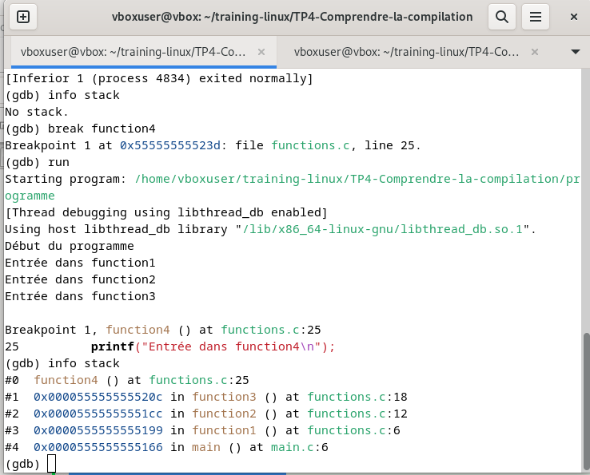

# 🧮 Projet GDB

## Definition du gdb
Commande permettant de débugger un programme, elle permet de:
- s’arrêter durant l’exécution pour observer après chaque ligne exécutée, à un point d’arrêt placé préalablement, quand une condition devient vraie, lors de l’occurence d’une erreur.
- observer l’état du programme durant son exécution:contenu des variables, valeur d’une expression, succession d’appels de fonction imbriqués
- Parcourir la pile d'appels
- les valeurs en mémoire
- Analyser les erreurs de segmentation


## L'option -g de gcc et son lien avec le gdb
L'option -g de gcc génère des informations de débogage dans le fichier exécutable. Sans cette option, GDB ne peut pas :
- Associer le code machine aux lignes de code source
- Afficher les noms des variables
- Montrer la structure du programme

## Compilation et Demarrage de gdb

- installation de gdb
```bash
sudo apt update
sudo apt install gdb
```

- Associer le code machine aux lignes de code source, lancer gdb et attacher le fichier programme à exécuter
```
# Avec informations de débogage (recommandé)
gcc -g programme.c -o programme

# Avec plus d'informations de débogage
gcc -g3 programme.c -o programme

# Désactiver l'optimisation (recommandé pour le debug)
gcc -g -O0 programme.c -o programme
# Lancer GDB avec votre programme
gdb ./programme

# Ou lancer GDB puis charger le programme
gdb
(gdb) file ./programme
```

## Etape de débogage
Ici nous illustrons par des images les différente étape de débogage du programme  avec des explications associées.

### Etape1 : Demarage du gdb et exécution du fichier programme dans le gdb
- 

### Etape2 : Fixation du point d'arret et affichage de la pile courante en execution
- 

* Sur cet image Au moment où nous sommes dans la function4 (juste avant l'accès hors limites),  nous avons 5 frames de la pile d'appels (Call Stack) en cour d'execution affiché.
- Frame #0:la première frame tout au dessus d'indice #0 est la frame actuellement exécutée. cette frame contient **Adresse de retour** (où reprendre après la fonction), **Variables locales** (variables déclarées dans la fonction), **Paramètres** (arguments passés à la fonction), **Registres sauvegardés** (état du processeur)
- Frame #1 : function3() - A appelé function4
- Frame #2 : function2() - A appelé function3
- Frame #3 : function1() - A appelé function2
- Frame #4 : main() - Point de départ - A appelé function1
on a commencé par main donc l'exécution à entrainer la création de la pile et son insertion comme 1 frame de la pile, ensuite main appele function1 qui est ajouté a la pile , qui lui meme appele f2 qui est egalement ajouté à la pile ect ect.'

**Chaque appel de fonction ajoute un frame à la pile, et chaque retour enlève un frame. C'est le mécanisme LIFO (Last In, First Out) de la pile d'appels.**

## Etape 3 : Navigation dans la fonction d'arret qui contient le bug
- 
Ici après avoir break sur la function4 et run nous somme maintenant a l'interieur de celleci. nous Exécutons la ligne courante à ligne courante avec next, sans entrer dans les fonctions appelées.
- 
Ici avec les commande `step(s)` pour exécuter et entrer dans les function appelé et `finish(fin)` pour Terminer l'exécution de la fonction courante et retourne au niveau appelant.

## Track et debug sur la function4
- 
- 
Ici nous Inspectons les variables et de la pile, accedons à leir valeur avec possibilite de modifier pour verification

## Commande essentiel pour le traquage pas à pas
```bash
next (n) : Exécute la ligne suivante (ne rentre pas dans les fonctions)
step (s) : Exécute la ligne suivante (rentre dans les fonctions)
stepi (si) : Exécute l'instruction machine suivante (le plus granulaire)
```

## Analyse après l'erreur Si le programme plante :
```bash
(gdb) backtrace full  # Pile d'appels avec variables locales
(gdb) info registers  # État des registres au moment du crash
(gdb) x/10i $pc-20    # Instructions autour du pointeur d'instruction
(gdb) info frame      # Informations sur le frame actuel
```

## Points d'arrêt conditionnels et Utilisation de watch pour surveiller la mémoire
```bash
(gdb) watch *(int*)0x7fffffffdc28  # Surveiller l'adresse de tableau[10]
(gdb) continue  # S'arrêtera quand cette mémoire sera lue/écrite
(gdb) break function4 if tableau[2] == 3
(gdb) break 29 if i == 10  # S'arrêter à la ligne 29 seulement quand i vaut 10
```

### Commande avancé

- Points d'arrêt conditionnels
```bash
 (gdb) break 10 if i == 2    # S'arrêter seulement quand i == 2
(gdb) condition 1 temp > 10 # Ajouter condition au breakpoint #1
```

- Watchpoints (surveillance de variables)
```bash
 (gdb) watch temp            # S'arrêter quand 'temp' change
(gdb) rwatch temp           # S'arrêter quand 'temp' est lu
(gdb) awatch temp           # S'arrêter quand 'temp' est lu ou écrit
```

- Examiner la mémoire
```bash
 (gdb) x/10i $pc            # 10 instructions à partir du PC
(gdb) x/4wx &variable      # 4 mots en hexa à l'adresse de variable
(gdb) disassemble          # Code assembleur de la fonction courante
```

- Modifier des valeurs
```bash
(gdb) set variable = nouvelle_valeur
(gdb) set temp = 100       # Changer la valeur de temp
```

